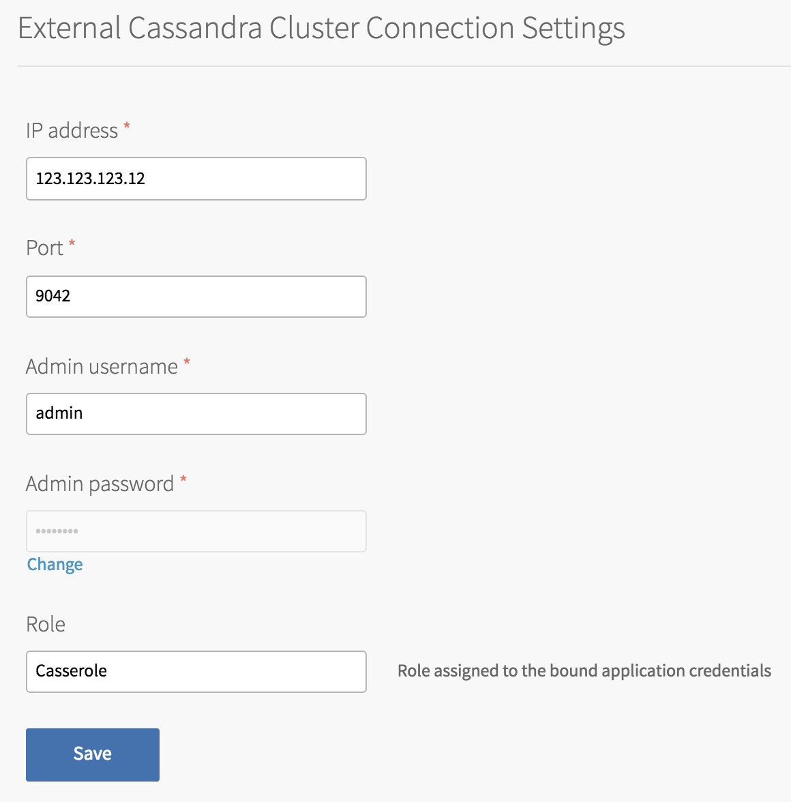
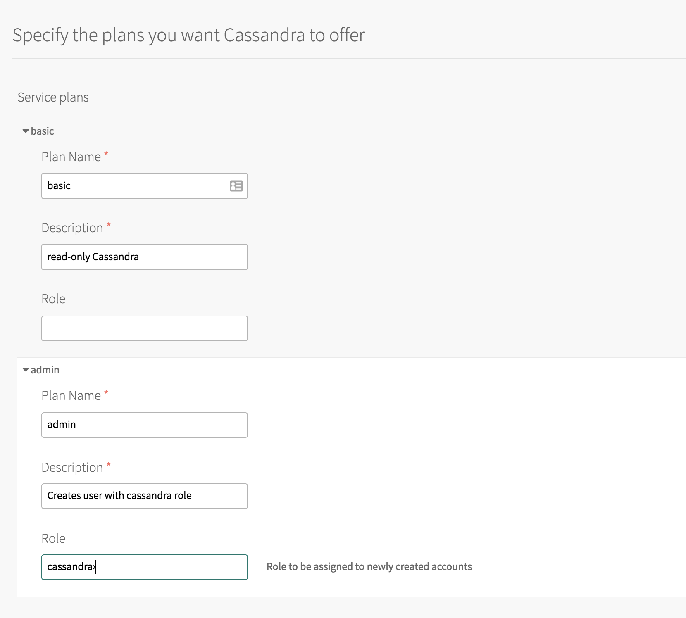

## DataStax Enterprise Cassandra Configuration

In addition to the standard service tile settings, the DataStax Enterprise Cassandra tile
requires to configure the connection to an existing Cassandra Cluster.

## Cassandra Cluster Settings

The product requires an external DataStax Enterprise Cassandra cluster.

The following fields on the configuration page are mandatory:

* IP Address
* Port - specify a setting different from the default value of 9042
* Admin username
* Admin password

The admin credentials would be used for managing users in order to bind and unbind CF applications.

## Service plans

Tile requires you to set at least one plan. You have to set mandatory Name and Description for the plan.
Optionally, a role can be configured for each plan. That role would be assigned to the bound application credentials.
If unset, the credentials would not get any role assigned.

