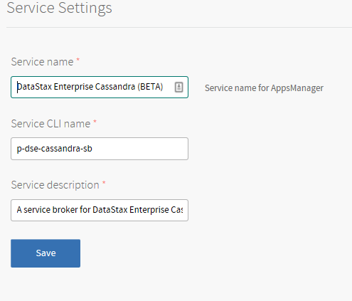

To configure Datastax Enterprise Cassandra, navigate to the tile in the Ops Manager Installation Dashboard and click the **Settings** tab.

You can configure following items:

## Service Settings

Here you can change service name in CF CLI and ApsManager and also change service description

## Cassandra Cluster Settings

The product requires an external DataStax Enterprise Cassandra cluster.
The following fields on the configuration page are mandatory:

* IP Address
* Port - you can specify a setting different from the default value of 9042
* Admin username
* Admin password

The admin credentials would be used for managing users in order to bind and unbind CF applications.

## Service plans

Tile requires you to set at least one plan. You have to set mandatory Name and Description for the plan.
Optionally, a role can be configured for each plan. That role would be assigned to the bound application credentials.
If unset, the credentials would not get any role assigned.

## Service Access

By default all service plans for the service are private. You can check "Enable global access to plans of service DataStax Enterprise Cassandra (BETA) 
Save"

